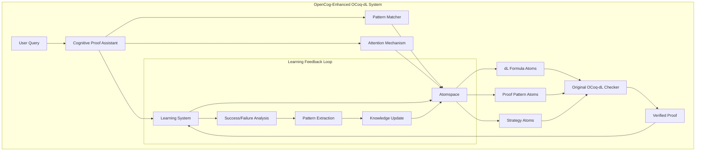

# OpenCog Integration with OCoq-dL

## Overview

This document describes the integration of OpenCog-inspired cognitive architectures with the OCoq-dL differential dynamic logic framework. The integration provides automated theorem proving, pattern learning, and cognitive reasoning capabilities for dL proofs.

## Architecture



## Core Components

### 1. Atomspace (`opencog/atoms.v`)

The Atomspace provides a unified knowledge representation for dL formulas, programs, and terms:

- **Atom Types**: ConceptNode, PredicateNode, ImplicationLink, BoxLink, etc.
- **Truth Values**: Probabilistic truth with strength and confidence
- **Conversion Functions**: Transform dL constructs to/from atoms

```coq
(* Convert dL formula to cognitive atom *)
Definition formula_to_atom (f : Formula) (id : nat) : Atom

(* Add formula to atomspace *)  
Definition add_formula (as : Atomspace) (f : Formula) : Atomspace
```

### 2. Cognitive Reasoning (`opencog/reasoning.v`)

Implements pattern matching and inference mechanisms:

- **Pattern System**: Match dL formula structures 
- **Attention Mechanism**: Focus on relevant knowledge
- **Inference Rules**: Forward/backward chaining
- **Meta-reasoning**: Proof strategy selection

```coq
(* Pattern matching for dL formulas *)
Fixpoint match_pattern (p : Pattern) (f : Formula) : option PatternSubst

(* Generate proof plan using cognitive analysis *)
Definition generate_proof_plan (f : Formula) (cas : CognitiveAtomspace) : ProofPlan
```

### 3. Learning System (`opencog/learning.v`)

Adaptive learning from successful and failed proofs:

- **Pattern Extraction**: Learn proof templates from successful proofs
- **Success Tracking**: Monitor pattern effectiveness
- **Continuous Learning**: Improve over time
- **Meta-learning**: Adapt learning parameters

```coq
(* Learn from successful proof *)
Definition learn_from_successful_proof (f : Formula) (proof : list step) 
  (learner : CognitiveLearner) : CognitiveLearner

(* Suggest proof steps based on learned patterns *)
Definition suggest_proof_steps (f : Formula) (learner : CognitiveLearner) : 
  option (list step)
```

### 4. Integration Layer (`opencog/integration.v`)

Seamless integration with existing OCoq-dL infrastructure:

- **Enhanced Proof Checker**: Cognitive-aware verification
- **Proof Assistant**: Automated proof suggestions
- **Optimization**: Improve existing proofs
- **Explanation**: Generate human-readable explanations

```coq
(* Cognitive proof assistant *)
Definition cognitive_proof_assistant (goal : Formula) 
  (cpc : CognitiveProofChecker) : option (list step * CognitiveProofChecker)

(* Multi-strategy proof search *)
Definition multi_strategy_proof_search (goal : Formula) 
  (cpc : CognitiveProofChecker) (max_time : nat) : 
  option (list step * string * CognitiveProofChecker)
```

## Key Features

### Automated Proof Discovery

The system can automatically discover proofs for dL formulas using:

1. **Pattern Matching**: Match current goal against learned patterns
2. **Cognitive Search**: Explore proof space using attention mechanisms  
3. **Multi-strategy Approach**: Combine different proof techniques

### Adaptive Learning

- **Success/Failure Analysis**: Learn from both successful and failed attempts
- **Pattern Generalization**: Extract reusable proof templates
- **Performance Optimization**: Improve proof efficiency over time

### Attention-Based Reasoning

- **Relevance Filtering**: Focus on most relevant knowledge
- **Resource Management**: Allocate reasoning resources efficiently
- **Dynamic Prioritization**: Adapt priorities based on context

### Human-AI Collaboration

- **Proof Hints**: Suggest next steps to human users
- **Explanation Generation**: Explain reasoning behind suggestions
- **Interactive Development**: Support incremental proof construction

## Usage Examples

### Basic Cognitive Proof

```coq
(* Initialize cognitive proof checker *)
Definition cpc := init_cognitive_proof_checker.

(* Simple safety property: v≥0 → [x:=x+v] x≥0 *)
Definition safety_formula := 
  KFimply (KFgreaterEqual (KTread varv) (KTnumber (KTNnat 0)))
          (KFbox (KPassign varx (KTplus (KTread varx) (KTread varv)))
                 (KFgreaterEqual (KTread varx) (KTnumber (KTNnat 0)))).

(* Get automated proof *)
Definition auto_proof := cognitive_proof_assistant safety_formula cpc.
```

### Learning from Examples

```coq
(* Learn from successful proof *)
Definition learned_system := 
  learn_from_successful_proof safety_formula 
    [step_imply_right "H"; step_assign "G" [] []; step_assumption "H"]
    init_learner_with_patterns.

(* Apply learned knowledge to new problem *)
Definition new_proof := suggest_proof_steps similar_formula learned_system.
```

### Batch Processing

```coq
(* Process multiple proofs for learning *)
Definition proof_batch := [
  (formula1, proof1);
  (formula2, proof2);
  (formula3, proof3)
].

Definition trained_system := process_proof_batch proof_batch cpc.
```

## Advanced Features

### Pattern System

The pattern system supports sophisticated matching:

- **Variable Patterns**: `PatternVar "P"` matches any formula
- **Structural Patterns**: `PatternImplication p1 p2` matches implications
- **Modal Patterns**: `PatternBox prog_pat form_pat` matches box modalities
- **Wildcard Patterns**: `PatternAny` matches anything

### Attention Dynamics

Attention values control resource allocation:

- **STI (Short-term Importance)**: Immediate relevance
- **LTI (Long-term Importance)**: Historical significance  
- **VLTI (Very Long-term Importance)**: Fundamental importance

### Multi-Strategy Search

Multiple proof strategies are attempted:

1. **Pattern-based**: Use learned proof templates
2. **Cognitive Search**: Explore using attention mechanisms
3. **Hybrid Approaches**: Combine multiple techniques

## Performance Considerations

### Efficiency Optimizations

- **Incremental Learning**: Update knowledge without full recomputation
- **Attention Filtering**: Process only relevant atoms
- **Pattern Caching**: Cache frequently used patterns

### Scalability

- **Bounded Resources**: Limit memory and computation usage
- **Pruning**: Remove ineffective patterns
- **Hierarchical Organization**: Structure knowledge hierarchically

## Integration with Existing Code

The OpenCog system integrates seamlessly with existing OCoq-dL components:

### Compatibility

- **Formula Representation**: Uses existing `Formula` type
- **Proof Steps**: Compatible with existing `step` type
- **Checker Integration**: Extends existing proof checker

### Migration Path

1. **Gradual Adoption**: Can be enabled selectively
2. **Fallback Support**: Falls back to original checker if needed
3. **Performance Monitoring**: Track cognitive system performance

## Future Enhancements

### Planned Features

- **Advanced Pattern Learning**: More sophisticated pattern extraction
- **Distributed Reasoning**: Multi-agent cognitive architectures
- **Neural Integration**: Hybrid symbolic/neural reasoning
- **Interactive Visualization**: Visual exploration of proof space

### Research Directions

- **Cognitive Architectures**: More realistic cognitive models
- **Transfer Learning**: Apply knowledge across domains
- **Explainable AI**: Better explanation generation
- **Formal Verification**: Prove correctness of cognitive components

## Conclusion

The OpenCog integration provides a powerful cognitive enhancement to OCoq-dL, enabling:

- **Automated Theorem Proving**: Reduce manual proof effort
- **Intelligent Assistance**: Provide helpful suggestions to users
- **Adaptive Learning**: Improve performance over time
- **Human-AI Collaboration**: Support interactive proof development

This creates a more intelligent and user-friendly theorem proving environment for differential dynamic logic.